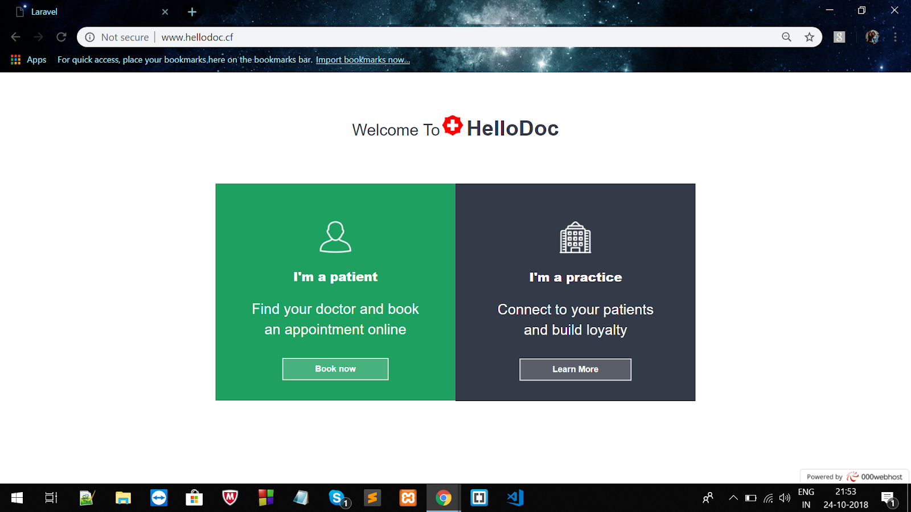
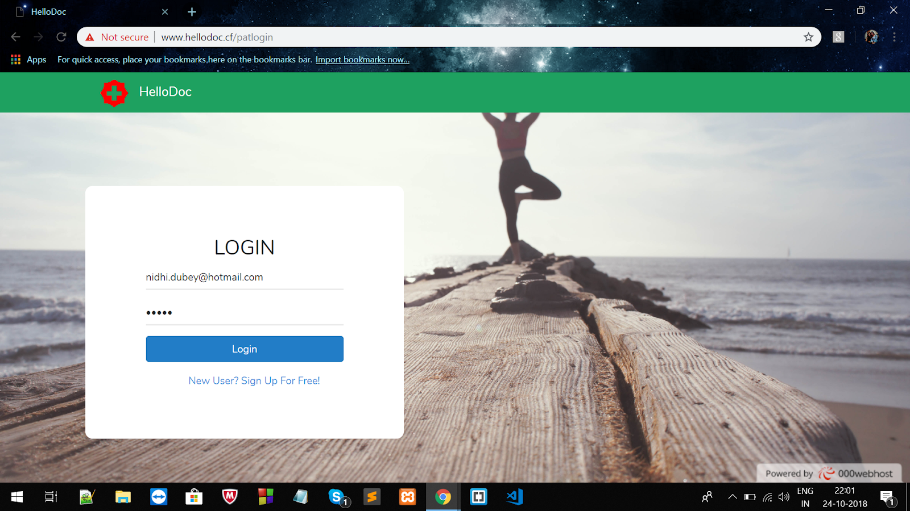
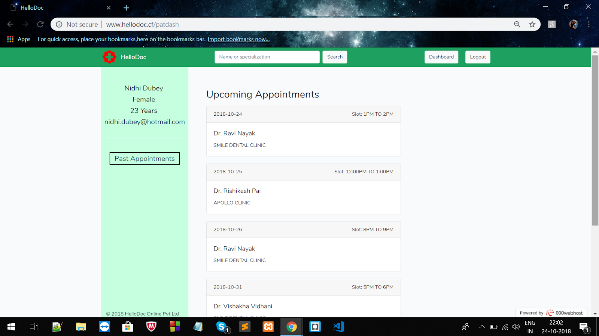
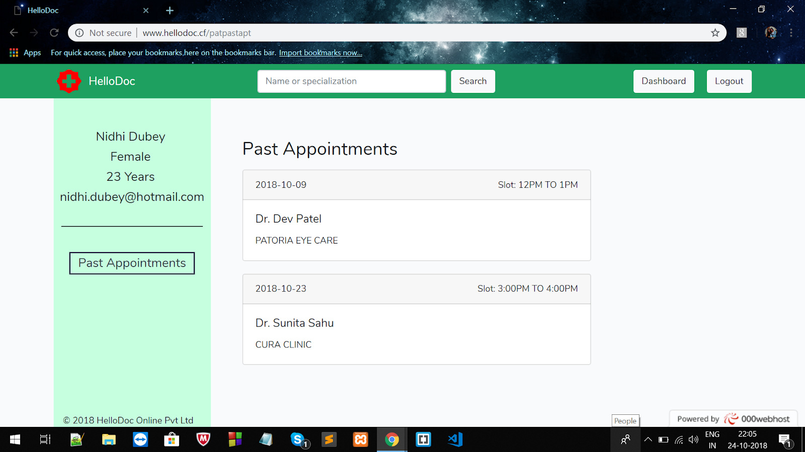
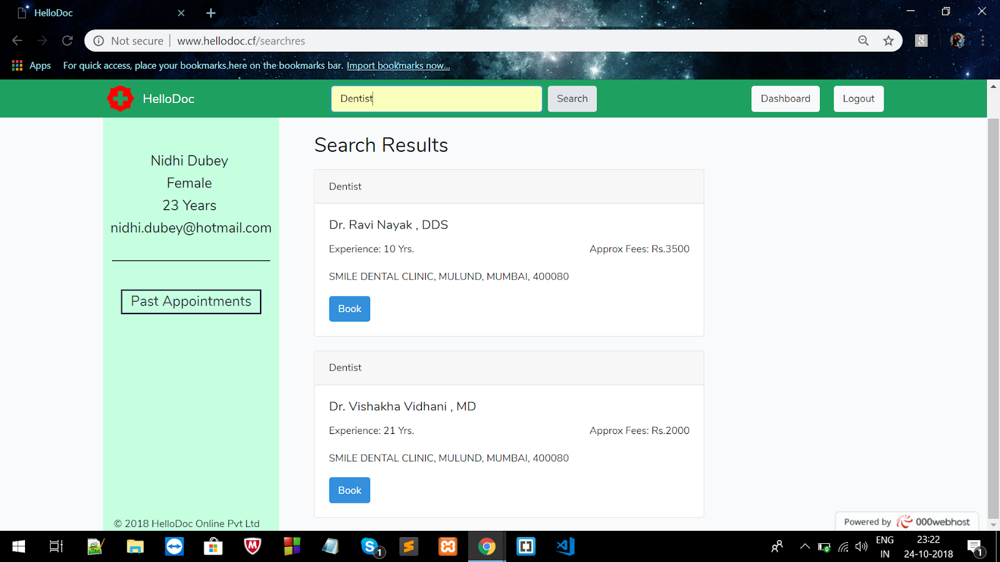
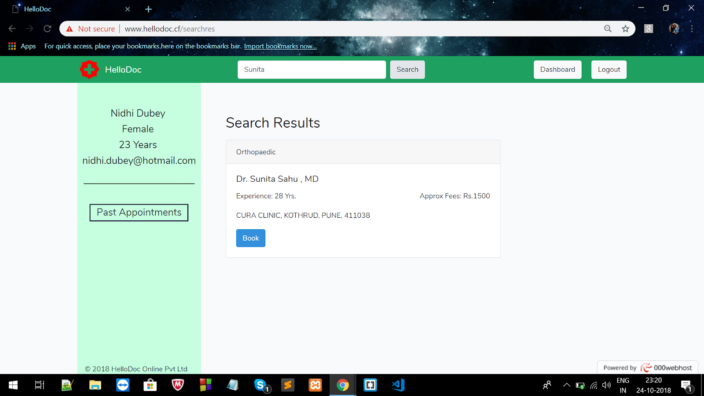
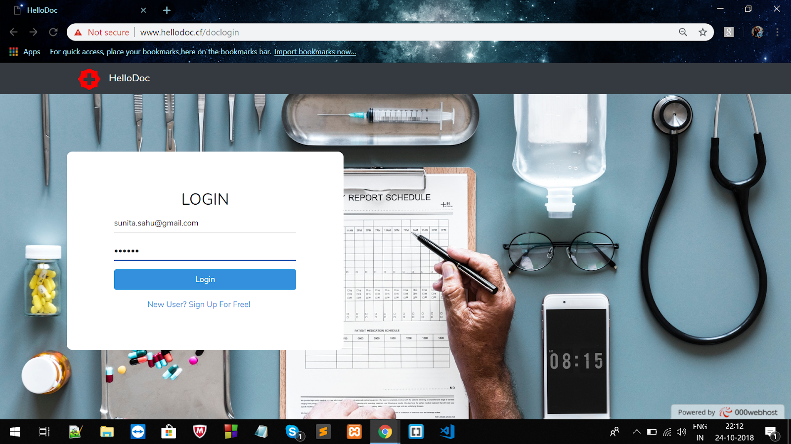
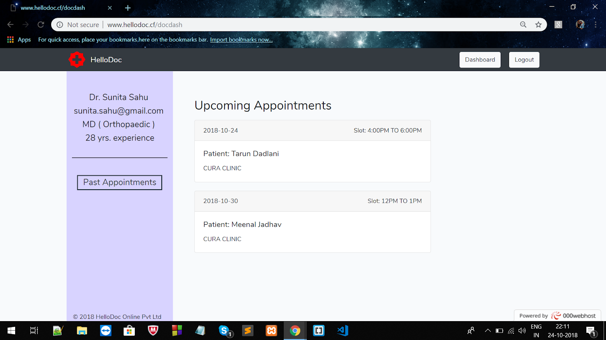
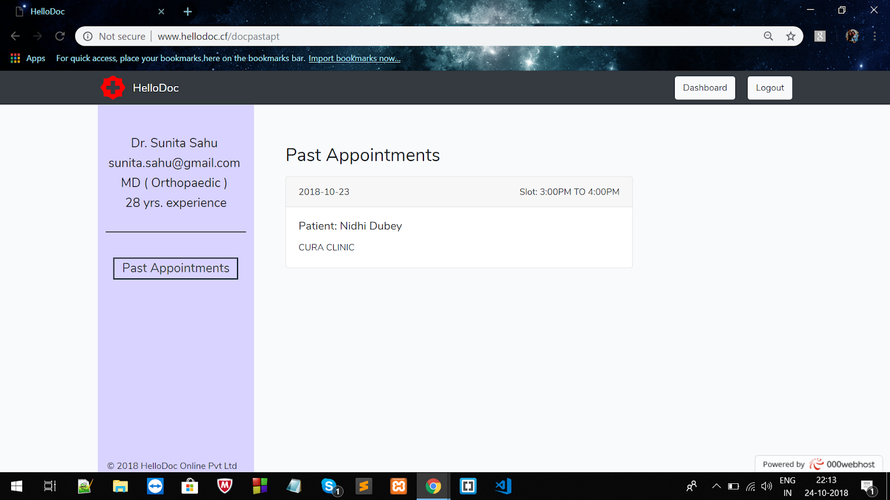

# HelloDoc
## A web portal for doctor appointments, developed using Laravel

## Features
### For patients-
- Search for a doctor by name and specialization
- Book an appointment
- View upcoming and past appointments

### For doctors-
- View upcoming and past appointments

## Screenshots
1. Home Page

2. Patient Login

3. Patient Dashboard

4. Patient's Past Appointments

5. Search By Specialization

6. Search By Name

7. Doctor Login

8. Doctor Dashboard

9. Doctor's Past Appointments

### NOTE- You may have to change few settings related to server and database to run using XAMPP as this code was modified for hosting on a server.
